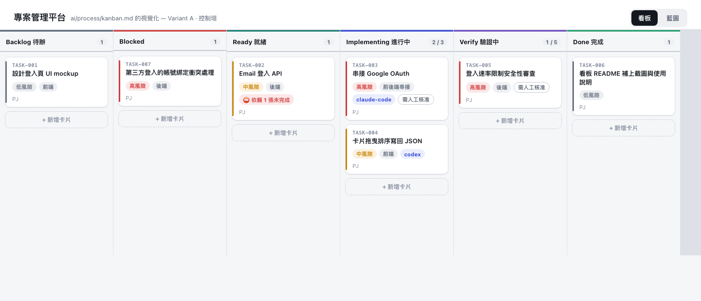
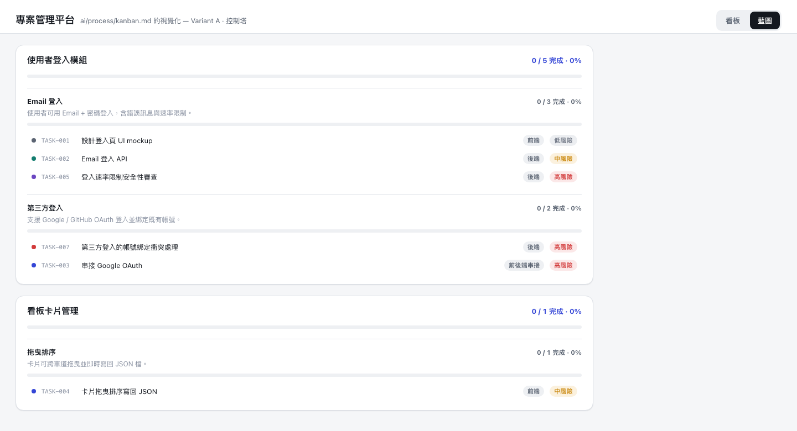

# Monstrare

**English** | [繁體中文](README.zh-TW.md)

**A cloneable workflow layer that stops AI coding agents from shipping non-trivial changes based on vague requirements.**

Copy this repo into any project. Claude Code, Codex, and other agentic tools
then follow the same gated process — spec, plan, task cards, implementation,
verification, review — before code reaches production.

## Preview

The kit ships a local, zero-dependency Kanban board (`tools/kanban/`, `npm run kanban`)
that visualizes every task's progress through the gates below.




## The Problem

- Agents start coding from vague prompts and produce large, unreviewable diffs.
- "Looks right" ships without tests, screenshots, or evidence.
- Architecture and security get reviewed after the code is already written, if at all.
- Every project reinvents its own ad-hoc process for working with agents.

## How It Works

Every non-trivial change moves through these phases, defined in full in
`ai/process/workflow.md`:

| Phase | Output | Gate |
| --- | --- | --- |
| 0. Intake | Problem statement, goal, constraints, unknowns | Vague request -> go to Clarification |
| 1. Context Discovery | Task-specific context pack: files, patterns, risks, verification commands | — |
| 2. Clarification | `feature-spec.md`, non-goals, acceptance criteria | Human approval |
| 3. UI Mockup *(if UI)* | Screen/state maps, 2-3 variants, trade-offs | Human picks a variant |
| 4. Architecture Plan | Files touched, data/API contracts, rollback plan | High-risk -> architect + security + test review |
| 5. Task Cards | AI-ready cards meeting `definition-of-ready.md` | — |
| 6. Implementation | One approved card at a time, small diffs | Scope change -> stop and ask |
| 7. Verification | Tests, typecheck, lint, build, security scan, screenshots | — |
| 8. Review | Product / UX / architecture / security / test / code review | `review-gates.md` |
| 9. Human Acceptance | What changed, evidence, residual risk, follow-ups | No evidence -> not done |

New project with no Epic/User Story backlog yet? Run the `project-kickoff`
skill first — it splits the project into Epics -> User Stories -> Tasks and
seeds `tools/kanban/`.

## Rules Enforced On Every Agent

From `AGENTS.md`, read before any agent touches this repository:

- No non-trivial change from a vague request.
- Start from context discovery, not assumptions.
- `definition-of-ready.md` before implementation, `definition-of-done.md` before calling anything done.
- UI changes need `screen-spec.md` + `mockup-decision.md`.
- High-risk changes need architecture + security + test review.
- Reuse existing patterns over new abstractions.
- Stay inside the approved task card's scope; no unrelated file changes without saying so.
- No completion claim without evidence: commands, output, screenshots, residual risk.

Agent output is never itself an approval — humans sign off at every gate in
`ai/process/review-gates.md`.

## What This Replaces

| Inspiration | Borrowed idea |
| --- | --- |
| BMAD Method | Role-based AI agile workflows |
| GitHub Spec Kit | Spec-first: clarify -> plan -> tasks -> implement |
| Kiro Specs | Requirements, design, and task artifacts |
| Task Master | PRD-to-task decomposition, model routing |
| Serena | Semantic project search and context retrieval |
| SuperClaude | Slash-command style repeatable workflows |
| Archon | Deterministic, gate-based workflow execution |
| Plandex | Large-context planning, diff review, controlled execution |
| CodeRabbit / Qodo | Review-first quality gates |

Not vendored — this kit is a process layer that can call or coexist with any
of them.

## Repository Layout

```text
AGENTS.md                     # Codex entrypoint
CLAUDE.md                     # Claude Code entrypoint
.claude/skills/               # Claude Code skills
.claude/agents/               # Claude Code subagents
.codex/skills/                # Codex skills
.codex/config.toml            # Optional Codex local defaults
ai/process/                   # Shared workflow rules
ai/templates/                 # Specs, task cards, review reports
ai/context/                   # Project map and search guides
ai/checklists/                # Security and testing gates
ai/skills/                    # Canonical skill content shared by .claude/skills and .codex/skills
ai/examples/                  # Example task and feature artifacts
tools/kanban/                 # Local Kanban board implementing ai/process/kanban.md
```

## Quick Start

**Starting a new project?** Clone this repo and build directly inside it —
`AGENTS.md`, `CLAUDE.md`, and the whole `ai/` toolkit are already at the root.

```bash
git clone https://github.com/pjwang2022/Monstrare.git my-project
cd my-project
rm -rf .git && git init   # start your own history
```

**Adding this to an existing codebase instead?** Skip to
[Install Into An Existing Project](#install-into-an-existing-project) below.

Either way, once the files are in place:

1. Run project intake:

   ```text
   Use the project-search skill to create ai/context/project-map.md and ai/context/code-search-guide.md.
   Do not implement anything yet.
   ```

2. Start a feature through the spec gate:

   ```text
   Use spec-interrogation for: <feature idea>.
   Create a feature spec, screen specs if UI is involved, and AI-ready task cards.
   Stop before implementation for human review.
   ```

## Install Into An Existing Project

```bash
scripts/install-into-project.sh /path/to/your/project
```

Skips existing `AGENTS.md`/`CLAUDE.md`, then copies process files, templates,
checklists, and Claude/Codex skills into the target project.

```bash
scripts/check-governance.sh   # self-check from the repo root
```

## AI Kanban

`ai/process/kanban.md` is the board policy — it tracks whether a task is
ready for safe agent execution, not just its status. The `tools/kanban/`
implementation above is optional; the policy doesn't require this specific tool.

Recommended columns:

```text
Inbox -> Needs Clarification -> Needs Product Approval -> Needs UI Mockup
-> Needs Architecture Plan -> Needs Task Cards -> AI Ready -> Agent Working
-> Needs Verification -> Needs Review -> Human Acceptance -> Done
```

## Recommended Tool Pairings

- Serena MCP for semantic code search when available.
- Task Master for automated task expansion from a PRD.
- Spec Kit for a full spec-first command stack.
- CodeRabbit, Qodo, Codex Review, or Claude review agents as a final review layer.
- Deterministic CI checks for lint, typecheck, tests, build, and security scanning.

## GitHub Workflow

- `.github/ISSUE_TEMPLATE/ai_task.yml` for AI-ready task intake.
- `.github/pull_request_template.md` for verification and review evidence.

Keeps GitHub Issues and PRs speaking the same governance language as Claude
Code, Codex, and local task cards.
